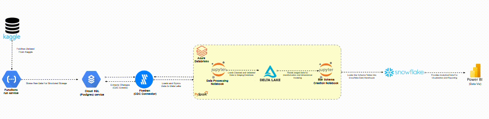
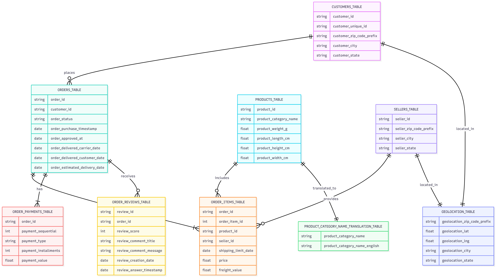
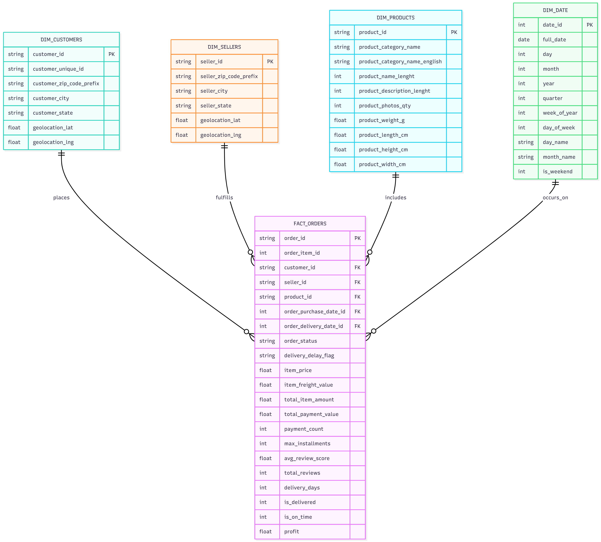
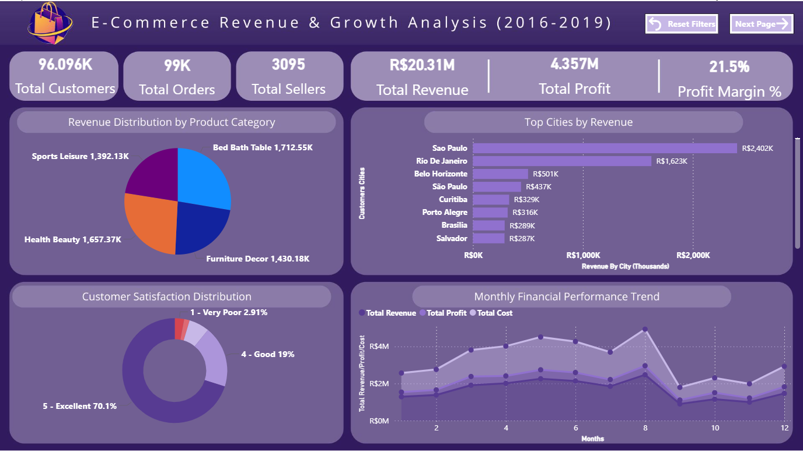
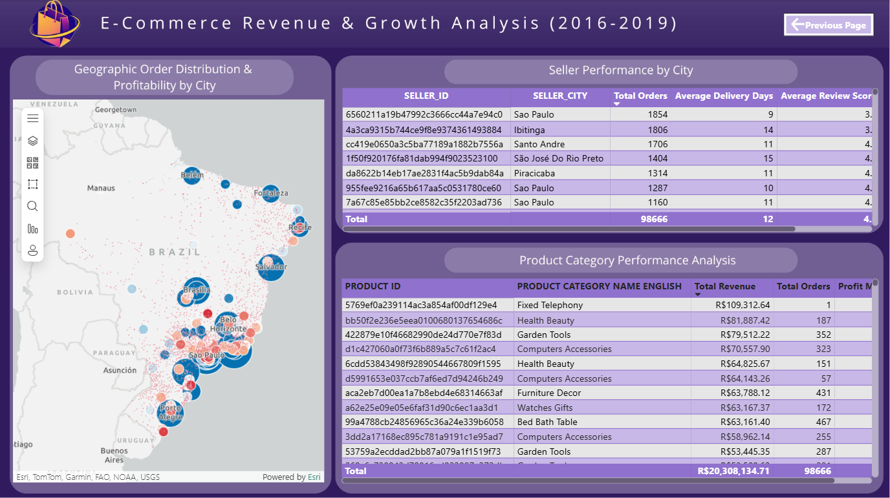

# 🏗️ End-to-End Data Engineering Pipeline

**Brazilian E-Commerce Data Platform: From Cloud Collection to Cloud Analytics**

A production-grade data engineering solution processing **99K orders** from **96K customers** across **3K sellers** with **R$20.3M revenue** analyzed. Demonstrates modern data stack practices with GCP Cloud Functions, PostgreSQL CDC via Fivetran (logical replication), Azure Databricks transformation, Snowflake dimensional warehouse, and Power BI executive dashboards.

---

## 📋 Table of Contents

- [Architecture Overview](#-architecture-overview)
- [Project Structure](#-project-structure)
- [Pipeline Stages](#-pipeline-stages)
- [Prerequisites](#-prerequisites)
- [Quick Start](#-quick-start)
- [Key Features](#-key-features)

---

## 🏛️ Architecture Overview



**Pipeline Flow:**

- **Data Ingestion**: Kaggle dataset → GCP Cloud Functions
- **Source Database**: Data stored in Google Cloud SQL PostgreSQL
- **CDC Replication**: Fivetran captures changes and replicates to Databricks
- **Transformation**: Azure Databricks processes data using PySpark
- **Staging Layer**: Delta Lake stores cleaned, deduplicated data
- **Data Warehouse**: Snowflake creates star schema for analytics
- **Analytics**: Power BI dashboards for business insights

---

## 📁 Project Structure

```bash
Data-Eng/
│
├── 📂 1-gcp-data-ingestion/
│   ├── main.py                    # GCP Cloud Functions entry point
│   ├── requirements.txt           # Python dependencies
│   ├── pyproject.toml            # Project config
│   ├── .python-version           # Python version spec
│   ├── .venv/                    # Virtual environment
│   ├── test/
│   │   └── test_kaggle_download.py # Test Kaggle download
│   └── README.md                 # Stage docs
│
├── 📂 2-fivetran-cdc-databricks-staging/
│   └── databricks_transformations.ipynb  # PySpark CDC cleaning notebook
│
├── 📂 3-snowflake-star-schema/
│   └── star_schema_transformation.ipynb  # PySpark star schema creation
│
├── 📂 4-sql-validation-queries/
│   └── dw_exploration_snowflake.sql # SQL validation queries
│
├── 📂 5-power-bi-analytics/
│   └── [ Power BI dashboard files and configurations]
│
├── 📂 queries/
│   ├── customers_cloud_sql.sql          # PostgreSQL customer queries
│   └── metadata_table_databricks.sql    # Databricks metadata queries
│
├── 📂 schemas/
│   ├── initial_schema/
│   │   ├── img.png                     # Initial data model diagram
│   │   └── schema.mmd                  # Initial ER diagram
│   └── star_schema/
│       ├── img.png                     # Star schema diagram
│       └── schema.mmd                  # Star schema relationships
│
├── 📄 README.md                         # Project overview
├── 📄 .gitignore                        # Git ignore patterns

```

## 🔄 Pipeline Stages

### **Stage 1: Data Ingestion (GCP Cloud Functions)**

**Directory**: `1-gcp-data-ingestion/`

**Purpose**: Collect Brazilian E-Commerce data from multiple sources

**Source Data Model**:



The diagram shows the complete Kaggle dataset structure with:

- **CUSTOMERS_TABLE** - Customer profile and location data
- **ORDERS_TABLE** - Order transactions and status tracking
- **ORDER_ITEMS_TABLE** - Individual items in each order
- **PRODUCTS_TABLE** - Product catalog with dimensions
- **PRODUCT_CATEGORY_NAME_TRANSLATION_TABLE** - Category name translations
- **SELLERS_TABLE** - Seller information and location
- **ORDER_REVIEWS_TABLE** - Customer reviews and ratings
- **ORDER_PAYMENTS_TABLE** - Payment methods and values
- **GEOLOCATION_TABLE** - Geographic coordinates and location names

**Components**:

- GCP Cloud Functions (Python)

**Key Files**:

- `main.py` - Cloud Function entry points
- `requirements.txt` - Python dependencies (google-cloud-storage, pandas, etc.)

**Outputs**:

- Download the data from Kaggle

**Data Sources**:

- Brazilian E-Commerce orders, customers, products
- Reviews, payments, seller information
- Geolocation and product categories

---

### **Stage 2: CDC Pipeline & Data Transformation (Fivetran + Databricks)**

**Directory**: `2-fivetran-cdc-databricks-staging/`

**Files**:

- `databricks_transformations.ipynb` - PySpark transformation notebook

**Purpose**: Replicate data from PostgreSQL with CDC, transform and clean data

**Components**:

- PostgreSQL database in Cloud SQL (GCP) with CDC enabled
- Fivetran CDC connectors with slowly changing dimension type 2
- Azure Databricks (Spark SQL transformations)
- Delta Lake staging tables

#### **Part 1: CDC Replication (Fivetran)**

**CDC Configuration**:

- **Logical Replication**: Enabled for optimized storage and incremental data capture
- Captures only changes (inserts, updates, deletes) instead of full table scans
- Minimizes network bandwidth and storage overhead

**Fivetran Connectors**:

- Source: PostgreSQL (Cloud SQL in GCP) with logical replication enabled
- Destination: Azure Databricks (Delta Lake)
- Schedule: Automated continuous sync
- CDC Mode: Enabled for incremental updates with slowly changing dimension type 2

**CDC Metadata**:

- `_fivetran_synced` - Last sync timestamp
- `_fivetran_deleted` - Soft delete flag
- `_fivetran_id` - Unique record ID

**Pipeline Checkpoint Table**:

```sql
CREATE TABLE IF NOT EXISTS workspace.google_cloud_postgres_public.pipeline_checkpoint (
    table_name STRING,
    last_sync_timestamp TIMESTAMP,
    last_run_time TIMESTAMP,
    rows_processed INT,
    status STRING
)
USING DELTA;
```

**Purpose**: Tracks incremental data loading progress

- `table_name` - Table being synced
- `last_sync_timestamp` - Last Fivetran sync time
- `last_run_time` - Last pipeline execution
- `rows_processed` - Count of rows in last sync
- `status` - Sync status (success/failed)

**Data Tables**:

```
stg_customers
stg_orders
stg_order_items
stg_payments
stg_reviews
stg_products
stg_sellers
stg_product_category_translation
stg_geolocation
```

#### **Part 2: Data Transformation (Databricks)**

**Key Transformations**:

1. **CDC Processing**

   - Get only new rows, updated rows, or deleted rows based on \_fivetran_synced timestamps
   - Keep all Fivetran-related columns (\_fivetran_synced, \_fivetran_deleted, \_fivetran_id)
   - No deduplication applied - duplicates preserved for CDC tracking

2. **Data Quality**

   - Make datatypes correct
   - Remove nulls
   - Verify business logic conditions
   - Validate row counts
   - Check for NULL values
   - Verify referential integrity

3. **Data Enrichment**
   - Join orders with geolocation
   - Translate product categories
   - Calculate delivery metrics
   - Aggregate payments and reviews

**Output**:

- Clean staging tables in Delta Lake
- Ready for star schema transformation

---

### **Stage 3: Staging Layer (Delta Lake)**

**Storage**: Azure Data Lake Storage

**Purpose**: Persistent storage of cleaned data before star schema creation

**Tables** (9 staging tables):

```
staging.stg_customers
staging.stg_orders
staging.stg_order_items
staging.stg_payments
staging.stg_reviews
staging.stg_products
staging.stg_sellers
staging.stg_product_category_translation
staging.stg_geolocation
```

**Benefits**:

- Create enriched dataframes and keep the latest rows
- Schema evolution support
- Time travel capabilities
- ACID transactions

---

### **Stage 4: Star Schema (Snowflake)**

**Directory**: `3-snowflake-star-schema/`

**File**: `star_schema_transformation.ipynb`

**Purpose**: Create dimensional model for analytics and create some measures for each order

**Schema Structure**:

**Fact Table**:

- `FACT_ORDERS` - Central fact table with all measures
  - Foreign keys to dimensions
  - Pre-calculated metrics (profit, delivery status, etc.)

**Dimension Tables**:

- `DIM_CUSTOMERS` (100K rows) - Customer demographics & location
- `DIM_SELLERS` (2K rows) - Seller information & location
- `DIM_PRODUCTS` (30K rows) - Product catalog & specifications
- `DIM_DATE` (1K+ rows) - Calendar dimension (2016-2018)

**Key Measures**:

- Revenue, profit, costs
- Delivery status & time
- Customer ratings & reviews
- Payment information

**Relationships**:



The diagram shows:

- **DIM_CUSTOMERS** connects to FACT_ORDERS via customer_id (FK)
- **DIM_SELLERS** connects to FACT_ORDERS via seller_id (FK)
- **DIM_PRODUCTS** connects to FACT_ORDERS via product_id (FK)
- **DIM_DATE** connects to FACT_ORDERS via order_purchase_date_id (FK)
- **FACT_ORDERS** contains all metrics and foreign keys to dimensions

---

### **Stage 5: SQL Validation (Snowflake)**

**Directory**: `4-sql-validation-queries/`

**Purpose**: Check if the star schema is working well and getting insights about dimensions and relationships

**Query Files**:

1. **dw_exploration_snowflake.sql**
   - Validate star schema functionality
   - Check table row counts and null values
   - Verify foreign key relationships
   - Analyze dimension and fact table relationships
   - Get insights about data distribution and quality

**Analytics Queries**:

- Table structure validation
- Null value analysis
- Foreign key integrity checks
- Data distribution insights
- Relationship validation between dimensions and fact table

---

### **Stage 6: Power BI Analytics (BI Dashboard)**

**Directory**: `5-power-bi-analytics/`

**Purpose**: Interactive business intelligence dashboards

**Dashboard Pages** (2 pages):

1. **Executive Summary** - KPIs, trends, overview
2. **Profitability Analysis** - Margins, costs, by product

**Key Features**:

- 10+ DAX calculated measures
- Dynamic slicers (date, location, category)
- KPI cards with trends

---

## 📋 Prerequisites

### Required Tools & Services

**Cloud Platforms**:

- ✅ Google Cloud Platform (GCP) account
- ✅ Microsoft Azure account (for Databricks)
- ✅ Snowflake account (DW & analytics)
- ✅ Power BI Desktop or Online

**Data Integration**:

- ✅ Fivetran account (CDC connectors)
- ✅ PostgreSQL instance (source database)

**Development**:

- ✅ Python 3.8+ (for GCP functions)
- ✅ Apache Spark (for Databricks)
- ✅ Git (for version control)
- ✅ Jupyter Notebooks (for development)

### Access Requirements

```

GCP:

- Cloud Functions API enabled
- Cloud Storage access

PostgreSQL:

- CDC enabled
- Network access
- User with replication rights

Azure Databricks:

- Workspace created
- Cluster access

Snowflake:

- Database created (ECOMMERCE_DB)
- Schema created (my_schema)
- Warehouse created (ECOMMERCE_DWH)
- Appropriate roles assigned

Power BI:

- Desktop or Service license
- Snowflake connector installed

```

---

## 🚀 Quick Start

### 1. Clone the Repository

```bash
git clone <repository_url>
```

### 2. Set Up Python Environment

```bash
# Create virtual environment
python -m venv .venv

# Activate virtual environment
# On Windows:
.venv\Scripts\activate

# Install dependencies
pip install -r 01-gcp-data-ingestion/requirements.txt
or
uv -r 01-gcp-data-ingestion/requirements.txt
```

---

## ⭐ Key Features

### 1. End-to-End Automation

✅ Automated data ingestion  
✅ Continuous CDC replication via Fivetran  
✅ Scheduled transformations in Databricks  
✅ Automated schema creation in Snowflake

### 2. Data Quality & Governance

✅ CDC deduplication with timestamp tracking  
✅ Data validation checks at each stage  
✅ Lineage tracking (data provenance)

### 3. Performance Optimization

✅ Incremental data updates (CDC mode)  
✅ Delta Lake optimization

### 4. Scalability

✅ Horizontal scaling in Databricks  
✅ Auto-scaling in Snowflake  
✅ Unlimited data volume support

### 5. Analytics & Insights

✅ 50+ production-ready SQL queries  
✅ 6 interactive Power BI dashboards  
✅ 15+ calculated DAX measures  
✅ Real-time customer satisfaction tracking (4.2★ average)  
✅ On-time delivery monitoring (94% rate)

### 📊 Key Metrics

- **Total Orders**: 99K | **Total Customers**: 96K | **Total Sellers**: 3K
- **Total Revenue**: R$20.31M | **Total Profit**: R$4.36M
- **Profit Margin**: 21.5% | **Delivery On-Time**: 94%
- **Customer Rating**: 4.2★ | **Dataset Period**: 2016-2019

### 📸 Dashboard & Schema Visualizations

For interactive dashboards, data flow diagrams, and ER schema diagrams, see the **`/imgs`** folder:

- Architecture flow diagrams
- Dashboard screenshots
- Star schema relationships
- Geographic analysis maps

#### Power BI Dashboard Pages

**Page 1: E-Commerce Revenue & Growth Analysis (2016-2019)**



**Page 2: Geographic Order Distribution & Seller Performance**



### Completed Components

- ✅ GCP data ingestion (Cloud Functions)
- ✅ PostgreSQL CDC source with logical replication (Fivetran)
- ✅ Databricks transformations (PySpark + Delta Lake)
- ✅ Staging layer (Delta Lake with ACID transactions)
- ✅ Snowflake star schema (4D + 1F tables)
- ✅ SQL validation queries (schema integrity checks)
- ✅ Power BI dashboards (2 pages, 10+ measures)
- ✅ Custom columns & measures documentation
- ✅ Power Query transformations guide
- ✅ LinkedIn post & repo recommendations
- ✅ Comprehensive documentation
